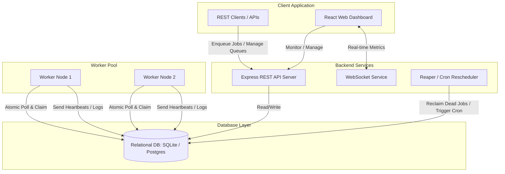
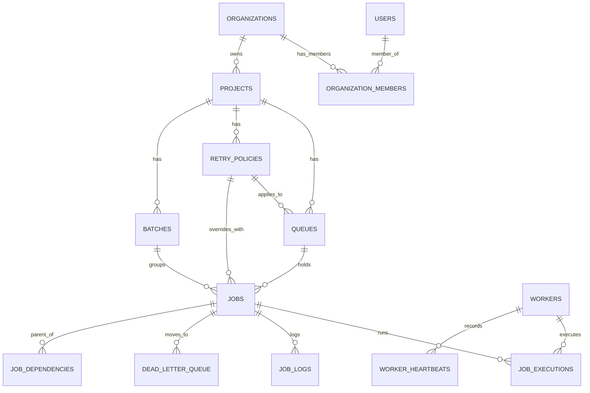

# VortexJob — Distributed Job Scheduler

VortexJob is a production-inspired, highly resilient distributed job scheduling platform capable of executing asynchronous background jobs across multiple concurrent workers. It is designed to be local-first (running instantly on SQLite in WAL mode) but production-ready (supporting PostgreSQL adapter swaps).

---

## 🚀 Key Features

*   **DAG Workflow Dependencies:** Define parent-child dependencies between jobs. Child jobs wait in the queue and are automatically unlocked once all parent jobs are completed successfully.
*   **Queue-Level Rate Limiting:** Enforce transaction-safe rate limits (e.g., max 100 jobs per 60 seconds) on a per-queue basis to protect downstream microservices.
*   **Atomic Claiming:** Prevent duplicate execution across multiple concurrent workers using transaction-safe claim queries (`BEGIN IMMEDIATE` in SQLite, `SELECT FOR UPDATE SKIP LOCKED` in PG).
*   **AI-Generated Failure Summaries:** Integrates with the Google Gemini API to analyze execution failure logs and suggest developer-focused resolutions directly in the dashboard UI.
*   **Decoupled Worker Service:** Dedicated background worker daemon supporting heartbeats, thread pool concurrency limits, and graceful shutdown intercepts (`SIGTERM` / `SIGINT`).
*   **Sleek Glassmorphic Dashboard:** Dark glassmorphic user interface built with React, Vite, TypeScript, and pure vanilla CSS with live metrics, throughput timelines, queue management, and job explorers.

---

## 📐 System Architecture

The following Mermaid diagram outlines the decoupled, multi-worker system architecture:



---

## 🗄️ Database ER Diagram

The relational database schema is normalized and indexed for high-concurrency write/read performance:



---

## 🛠️ Local Setup Instructions

### Prerequisites
*   Node.js (v20+ recommended)
*   npm

### 1. Backend Setup
1.  Navigate to the `backend` directory:
    ```bash
    cd backend
    ```
2.  Install dependencies:
    ```bash
    npm install
    ```
3.  Configure environment variables in `.env` (optional, defaults are set in `src/config.ts`):
    ```env
    PORT=3000
    JWT_SECRET=your-secret-key
    DB_PATH=./data/dev.db
    GEMINI_API_KEY=your_gemini_api_key_here
    ```
4.  Run database migrations and start the Express API Server:
    ```bash
    npm run dev
    ```

### 2. Worker Setup
1.  In a separate terminal, navigate to the `backend` directory:
    ```bash
    cd backend
    ```
2.  Start the worker daemon:
    ```bash
    npm run worker
    ```

### 3. Frontend Setup
1.  Navigate to the `frontend` directory:
    ```bash
    cd ../frontend
    ```
2.  Install dependencies:
    ```bash
    npm install
    ```
3.  Start the Vite React development server:
    ```bash
    npm run dev
    ```
4.  Open your browser and navigate to [http://localhost:5173](http://localhost:5173).

---

## 🧪 Running Automated Tests

We use **Vitest** for testing critical functionality including claiming atomicity, retry backoffs, and DAG workflow dependencies:

```bash
cd backend
npm run test
```

---

## 📄 Project Deliverables
For detailed engineering specifications, design tradeoffs, and API reference maps, refer to:
*   [Design Decisions & Trade-offs Document](file:///c:/Users/Asus/OneDrive/Desktop/projects/codity/docs/design_decisions.md)
*   [REST & WebSocket API Documentation](file:///c:/Users/Asus/OneDrive/Desktop/projects/codity/docs/api_documentation.md)
